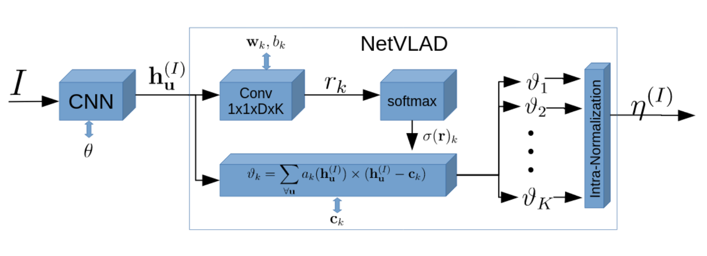

# NetVLAD Training
A sleek, easy to read/modify implementation of NetVLAD. This needs Keras2.
I have made this with Tensorflow1.11 as the backend but in principle should
also work with other backends supported by keras.



## Required Packages
[Keras](https://keras.io) 2.2.4 - Deep learning. <br/>
TensorFlow - Deep learning toolkit (v.1.08+, better use v1.12)<br/>
cv2 - OpenCV3.3 (Using opencv only for imread, resize, so wont matter the version so much) <br/>
numpy - Python Math <br/>
[imgaug](https://github.com/aleju/imgaug) - Data Augmentation. <br/>
Panda3D - Rendering (only if you use PandaRender.py/PandaRender)<br/>

## Run on Docker
I have created a docker image with the dependencies needed for this code. It needs a
functioning cuda9 on host pc and nvidia docker installed. Realistically you will want
to share a folder containing your data and code from host to docker container. This can be
done with the `-v` option in docker. Also you might want to have GUIs enabled for docker.
Have a look at [my blog for docker usage](https://kusemanohar.wordpress.com/2018/10/03/docker-for-computer-vision-researchers/)
 from a computer-vision researcher/developer perspective.

### Core Docker Usage
```
$(host) docker run --runtime=nvidia -it mpkuse/kusevisionkit:nvidia-cuda9-tf1.11-torch0.4 bash
```

### A more realistic Usage
```
$(host) cd $HOME/docker_ws
$(host) git clone <this repo>
$(host) cd <you data dir>; put your data learning here.
$(host) docker run --runtime=nvidia -it -e DISPLAY=$DISPLAY -v /tmp/.X11-unix:/tmp/.X11-unix -v $HOME/docker_ws:/app -v /media/mpkuse/Bulk_Data/:/Bulk_Data  mpkuse/kusevisionkit:nvidia-cuda9-tf1.11-torch0.4 bash
$(docker) python noveou_train_netvlad_v3.py
```


## Howto train?
The main code lies in `noveou_train_netvlad_v3.py`. It mainly depends on `CustomNets.py` (contains network definations, NetVLADLayer, data loading, data augmenters) ; on `CustomLosses.py` (contains loss functions
    and validation metrics) ; on `CustomDataProc.py` (contains data augmentation, performed with imgaug)

You may want to tune all other parameters such as
the K for NetVLAD, logging directory, SGD optimizer etc. directly from the script `noveou_train_netvlad_v3.py`
Contributions welcome to make this more user friendly.

```
python noveou_train_netvlad_v3.py
```

## Training Data
Make sure you have the Tokyo_TM, PittsburgData and correctly
set the paths. These two datasets can be obtained from
[here](https://www.di.ens.fr/willow/research/netvlad/).
This data is loaded on a per-batch basis. The relavant code is in `test_render.py`
and `CustomNets.py/dataload_()`.

It is also possible to use your own custom data for training, so long as you can
pick positive and negative samples for a query image from your dataset. Here, by positive sample
we refer to an image which is the sample physical place as the query image
but different viewpoints. By negative sample we mean an image with different
physical scene than the query image.

Google's streetview data and Mappillary data are excellent sources for training an even
general representation. Google provides a RestAPI to programatically retrive streetview image
given GPS co-ordinates. I have some scripts to load such data which I plan to release soon.
See [here](https://developers.google.com/maps/documentation/streetview/intro) for Streetview-api.
Similarly look at [Mappilary developer API](https://www.mapillary.com/developer) to retrieve mappilary data.

Additionally, data from SLAM system can be yet another good source of training data
for place recognition system.

It is also possible to train this network with a 3D model using Panda3d rendering engine.
See the script `test_render.py`. You need a working panda3d to work. In the
future I will make it easy to train with 3d models (in OBJ format).


**
If you need help setting up my code with your data, I am willing to help. Put up
info under issues on this github repo, I will try and help you out.
**


## Howto obtain image descriptor?
Usage:
```
python demo_keras_hdf5_model.py
```


## Pretrained Model
All my models to be released TODO. Until then, please put up an issue to on this
report to ask-for-it.
- model-1
- model-2

## Useful Utilities

#### - Print Memory and FLOPS related info on the Keras hdf5 models.
```
$ python util_kerasmodel_info.py --kerasmodel_h5file <.h5 file path>
```


#### - Edit input dimensions for a fully convolutional Keras hdf5 model.
```
$ python util_kerasmodel_edit.py --kerasmodel_h5file <.h5 file path> --rows <say 100> --cols <say 150>
```

### - Convert Keras model to Tensorflow protobuf (aka. frozen_graph)
```
$ python util_kerasmodel_to_tensorflow-pb.py --kerasmodel_h5file <.h5 file>
```

this will produce a .pb file and a .pbtxt look at the log. After that see the script, [test_frozengraph_predictions.py](test_frozengraph_predictions.py) for a sample
of how to do inference with this .pb.

### - Convert Tensorflow protobuf (aka frozen_graph .pb) to Nvidia's UFF
```
$ python util_pb_to_uff.py -pb <full path of a .pb file>
```

This is practically same as using the nvidia's commandline utility `convert-to-uff`. Python code adopted from [nvidia's convert_plan.py](https://github.com/NVIDIA-AI-IOT/tf_to_trt_image_classification/blob/master/scripts/convert_plan.py). See also the following section on TensorRT inference if using on TX2.


## How to Run keras models with TensorRT (TX2)
I store the keras models as HDF5 files (most prefered). These files need to be converted to
tensorflow's .pb (protobuf) files. These can then be converted to uff files. UFFParse
through the TensorRT provides mechanism to execute these kernels. Please refer to
my [blog pose](https://kusemanohar.wordpress.com/2019/05/25/hands-on-tensorrt-on-nvidiatx2/)
for more details in this regard.

The following script in this repo, will help you convert hdf5 keras models
to .uff. Beware, that this is a rapidly changing/evolving thing. Look at Nvidia's devtalk under TX2 for the latest update on this.
This info is accurate for May 2019.
```
python util_keras-h5-model_to-tensorflow-pb_to-nvinfer-uff.py --kerasmodel_h5file <path to hdf5 file>
```

I have also created a script (test_tensorrt_uffparser.py) to quickly test the UFFParser on your desktop (x86). For this you need TensorRT python binding. You may use my docker image for a quick test

```
docker run --runtime=nvidia -it -e DISPLAY=$DISPLAY -v /tmp/.X11-unix:/tmp/.X11-unix -v $HOME/docker_ws:/app -v /media/mpkuse/Bulk_Data/:/Bulk_Data  mpkuse/kusevisionkit:tfgpu-1.12-tensorrt-5.1 bash
```

## References
If you use my data/code or if you compare with my results, please do cite. Also cite
the NetVLAD paper whenever appropriate.

- Manohar Kuse and Shaojie Shen, “Learning Whole-Image Descriptors for Real-time Loop Detection and Kidnap Recovery under Large Viewpoint Difference“, submitted to Robotics and Autonomous Systems https://arxiv.org/abs/1904.06962
- Arandjelovic, Relja, et al. "NetVLAD: CNN architecture for weakly supervised place recognition." Proceedings of the IEEE Conference on Computer Vision and Pattern Recognition. 2016.

## Copyright Notice
Released under [MIT license](https://opensource.org/licenses/MIT) unless stated otherwise. The MIT license lets you do anything with the code as long as you provide acknowledgement to me on code use and do not hold me liable for damages if any. Not for commercial use. Contact me
if you wish to use it commercially.

## Author
Manohar Kuse <mpkuse@connect.ust.hk>
